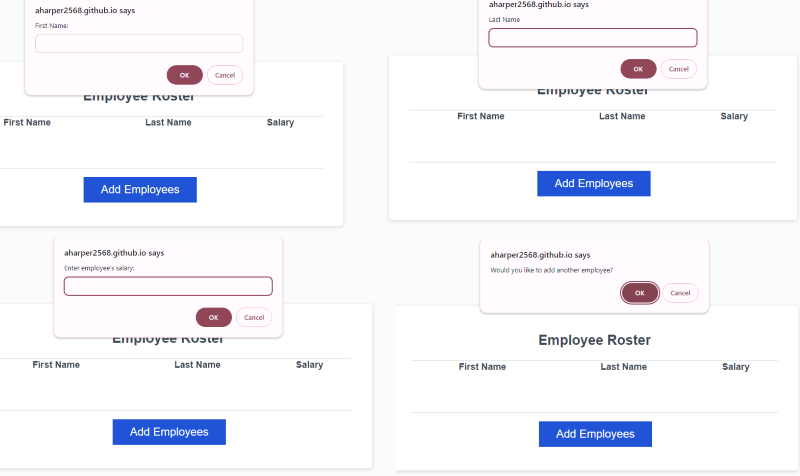
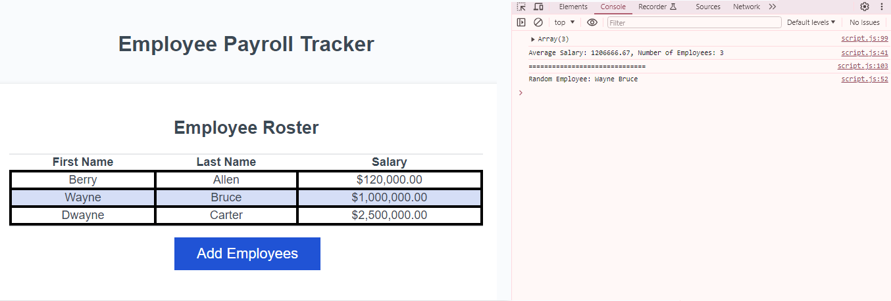

# PAYROLL-TRACKER

## Intro
This is a webpage utilizing javascript to allow the user to input and collect employee data with some secondary functions that can be found in the console.

## Usage
Clicking the "Add Employee" button will prompt the user to add an employee's first name, last name, and salary. 

Once the first set of information is entered, a prompt will appear asking if the user would like to add another employee. Clicking "Okay" will bring the user back to the first prompt. Clicking "Cancel" will end the prompt and display the user's input on the webpage.

Opening the console log will show the number of employees, the average salary between them, and the name of a randomly chosen employee.

## URLs
[Live URL](https://aharper2568.github.io/payroll-tracker/) \
[Github Repo](https://github.com/aharper2568/payroll-tracker)

## Screenshots

## Author/Contributors
Code lines 5 through 53 contributed by **Anthony Harper** in VScode

Code lines 33 to 53 were significantly improved by Xpert Learning Assistant

[For of loops](https://developer.mozilla.org/en-US/docs/Web/JavaScript/Reference/Statements/for...of)

[Math.round method](https://developer.mozilla.org/en-US/docs/Web/JavaScript/Reference/Global_Objects/Math/round)